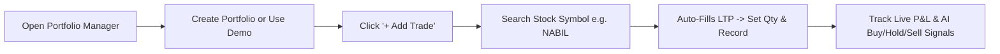

# 📖 FusionX AI Cockpit — Complete User Manual & Concept Guide

> **"Personal AI Trading Cockpit Manual"** — A comprehensive guide explaining every menu, core technical/fundamental trading concepts ("Kaunsa concept kya hit karta hai"), paper trading workflows, trading journal psychology, and strategy backtesting for NEPSE stocks.

---

## 📌 Section 1: FusionX Cockpit Menus Overview

| Menu Name | Purpose & Function | When to Use |
| :--- | :--- | :--- |
| **1. Dashboard** | Central Cockpit with live NEPSE ticker bulletin, market summary, top gainers/losers, and Pro TradingView Chart. | Daily market opening / overall market monitoring. |
| **2. Portfolio Manager** | Multi-Portfolio Paper Trading simulator, live Net Worth, P&L, sector allocation, AI Buy/Hold/Sell/Stop-Loss signals, and CSV/JSON backup. | Managing your paper trades, tracking growth/loss, and portfolio rebalancing. |
| **3. Trading Journal** | Log trade setups, target/SL, trader emotions (*"Disciplined Plan"*, *"FOMO Entry"*), and get AI habit retrospectives. | After placing/exiting trades to track trading psychology & win rate. |
| **4. AI Suggestions** | Master AI Score (0-100) recommendations, technical momentum picks, and risk-reward breakdown. | Finding high-probability stock candidates for entry. |
| **5. Sector Screener** | Filter stocks by sector, RSI/MACD/EMA technicals, or Natural Language AI Prompt Query. | Filtering the entire NEPSE universe for specific setups. |
| **6. My Watchlist** | Categorized Smart Watchlists (*"🔥 Breakouts"*, *"💎 Long-Term Core"*, *"🚀 High Growth"*). | Tracking your favorite stocks near support/resistance zones. |
| **7. Backtesting Lab** | Strategy testing on 15+ years of historical NEPSE data with equity curve, win rate %, max drawdown %, and trade log. | Testing any trading strategy before risking real money. |
| **8. Portfolio Analytics** | Correlation Matrix Grid, Sharpe Ratio per stock, Kelly Criterion optimal allocation %, and Risk Dial. | Checking portfolio diversification & risk concentration. |
| **9. Market Heatmap** | Color-coded visual tree map of NEPSE sectors and stock performance. | Quick visual snapshot of leading vs lagging sectors today. |

---

## 📌 Section 2: Core Trading & Technical Concepts ("Kaunsa Concept Kya Hit Karta Hai")

### 1. Master AI Score (0–100) 🎯
- **Kya hit karta hai**: Fundamental + Technical strength ka combined score.
- **Kaise samjhein**:
  - **70–100 (Bullish Buy Zone)**: Strong momentum, healthy technicals, low risk.
  - **50–69 (Neutral Watch Zone)**: Consolidation phase, hold or monitor.
  - **0–49 (Bearish Avoid Zone)**: Weak trend, price below support or high drawdown.

---

### 2. Exponential Moving Averages (EMA 9, 21, 50, 200) 📈
- **EMA 9 & 21 (Short-term Momentum)**:
  - **Golden Cross (EMA 9 > EMA 21)**: Buy signal — short-term buyers are aggressive.
  - **Death Cross (EMA 9 < EMA 21)**: Sell/Caution signal — momentum is fading.
- **EMA 50 & 200 (Major Trend Filter)**:
  - Price above EMA 200 = Major Long-Term Bull Trend.
  - Price below EMA 200 = Bear Trend / Caution.

---

### 3. Relative Strength Index (RSI - 14) ⚡
- **RSI < 35 (Oversold Bounce Zone)**: Stock heavily sold; high probability bounce / reversal buy opportunity.
- **RSI > 70 (Overbought Target Zone)**: Stock overbought; resistance area where profit booking is recommended.

---

### 4. Moving Average Convergence Divergence (MACD) 🌊
- **MACD Line > Signal Line**: Bullish momentum acceleration.
- **MACD Histogram Green Spikes**: Buying volume dominance.

---

### 5. Support & Resistance Levels (NepseAlpha Style) 🛡️
- **Support Level (Buy Zone)**: Floor price where institutional buyers step in to support the price.
- **Resistance Level (Target Zone)**: Ceiling price where profit takers sell.

---

### 6. Sharpe Ratio ⚖️
- **Formula**: `(Portfolio Annual Return - Risk Free Rate) / Annual Volatility`
- **Kya hit karta hai**: Risk-adjusted return performance.
  - **Sharpe > 1.5**: Excellent performance (high return with low risk).
  - **Sharpe < 0.5**: High volatility with poor return (risky).

---

### 7. Kelly Criterion % 🎲
- **Formula**: `Win Rate - ((1 - Win Rate) / Win-Loss Ratio)`
- **Kya hit karta hai**: Mathematically optimal position sizing per stock to avoid over-concentration (caps max recommended allocation at 15–25%).

---

## 📌 Section 3: Step-by-Step Paper Trading Guide



1. Go to **Portfolio Manager** (`manager`).
2. Select an active portfolio or click **"+ New Portfolio"** (e.g. *"Swing Trading Simulator"*).
3. Click **"+ Add Trade"**:
   - Use live search autocomplete to pick a stock (e.g. `NABIL`, `CHCL`, `NTC`).
   - Auto-fills latest LTP. Enter quantity (e.g., 200 shares).
   - Toggle **0.36% Broker Fee** for realistic simulation.
4. View **Live Net Worth**, **Unrealized P&L**, **Realized Profit**, and **AI Advice** (🟢 `BUY MORE`, 🟡 `HOLD`, 🔴 `TAKE PROFIT`, 🛑 `STOP LOSS`).
5. Click **"Backup"** to export JSON backup or **"CSV"** to import trade statements.

---

## 📌 Section 4: Step-by-Step Trading Journal & Psychology Guide

1. Go to **Trading Journal** (`journal`).
2. Click **"+ Log New Trade"**:
   - Select stock symbol, Entry Price, Exit Price, Target, and Stop Loss.
   - Select **Setup Strategy** (*"Volume Breakout"*, *"EMA Golden Cross"*, *"Support Rebound"*).
   - Select **Trader Mindset** (*"Disciplined Plan"*, *"FOMO Entry"*, *"Revenge Trade"*).
3. Review **AI Behavioral Retrospective**:
   - Tells you which setups generate max profit and alerts you if "FOMO Entries" are causing losses.

---

## 📌 Section 5: Step-by-Step Strategy Backtesting Guide

1. Go to **Backtesting Lab** (`backtester`).
2. Pick a preset strategy (*"RSI Oversold + MACD Cross"*, *"Volume Breakout"*) or enter a custom Python rule:
   ```python
   rsi < 35 and macd > macd_signal and close > ema50
   ```
3. Select date range (e.g. Jan 2022 to Dec 2024), starting capital, Take Profit %, and Stop Loss %.
4. Click **"Run Backtest"** to view equity curve chart, win rate %, max drawdown %, and complete trade log.
